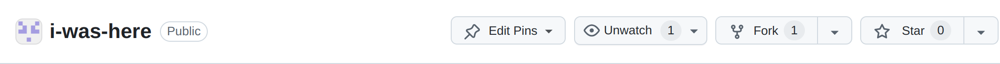

Git and GitHub provide a powerful set of tools for collaborating on code.
In order to demonstrate this, we have created a shared project on which we can practice.

<!--more-->

You can view [the live page] for the project.
It currently looks like this:



Your task is to follow the appropriate workflow to make a pull request to the site.

> This website will be created collectively by hundreds of students each making small updates.
Make your contribution stand out by adding some styles.

## Setup

Your task is to make an update to the project.
This will involve some basic set up:

1. Create a **fork** of the repository on github.
1. Create a local **clone** of your fork.

### Forking

The project lives in the [i-was-here] repository.
A source project like this is sometimes known as the *upstream* repository and it should be assumed to be constantly updating.

Since your github user does not have access to edit this repository, it won't be possible to push any code directly to it.
The only way to make contributions to the code is by *forking* the repository on github and creating a **pull request**.

> A pull request is a link to a version of the code with updates.
The repository owner(s) can choose to merge a pull request into the code.
> This is typically how you would make a contribution to an open-source project. 

The first step is to create your own personal **fork** of the *upstream* project on github.
Visit the [i-was-here] repository and click on the **fork** button in the github interface.

>There should be a banner in the source repository that should look something like this.
>
>
>
> Notice there is a **fork** button.

Clicking the button creates a **fork** of the project.
You should be taken to your newly created repository.

>The new repository will belong to your github user account and it should point to the source repository like this.
>
>
>
With your own copy of the code, you can make commits freely without conflicting with other developers.

Remember that this repository is a copy of the main project, the purpose of this repository is to be a store for your proposed changes.

### Cloning

Now we have our own copy of the repository on github, we can **clone** it onto our local filesystem using VSCode.

> Now carefully follow these instructions

The first thing we need to do is to tell VSCode to clone the repository.
This involves providing the correct url for your forked project.

Cloning can be convenient within VSCode but the steps are difficult to explain, so read this carefully.

The first step is to trigger the clone operation.
This can be done in a number of ways.

1. You can open a new VSCode window with no project loaded and there should be a **Clone Repository** button.
1. Alternatively, press *Ctrl + Shift + P* to open the command palette, type *"clone"* and select *"git: Clone"* from the list of commands.

Once you have triggered the clone operation, complete the following steps:

- Select the **Clone from GitHub** option and wait for the list of available repositories to load
- Start typing the name of the repository **"i-was-here"** and select it when it appears (make sure you select your **fork**, not the *upstream* version).
- Choose a location on your filesystem, this is where you want the downloaded **i-was-here** project folder to be saved

> If you have trouble with these steps, make sure you are logged into github and that you have forked the repository correctly.

## Making a contribution

With a local version of the code, you can now make your contribution with the following workflow.

1. Create a **branch** in your local repository for your changes.
1. Make commits in your **branch**.
1. **Push** your branch up to your github **fork**.
1. Create a **pull request** for your **branch** to be merged into the *upstream* project *main* branch.

Once you have a local copy of the **i-was-here** project open in VSCode, you can explore the code and run *live server* to review the site.
Don't make any changes yet.

### Branching

In order to keep the project *clean* we want to use **branches** to keep our proposed changes separate from the code we pulled from *upstream*.
All repositories have a default *main* (or sometimes *master*) **branch** which is what we have been working with so far.
We want this *main* branch to always reflect the state of the *upstream* repository without any of our changes.

> Git is a complex tool and there are many resources which explain branching.
If you are interested in understanding git more deeply then read about [git branches].
For a higher-level overview read about [github branches].
>
> For our purposes, we can think of a git **branch** as a pointer which points to a specific **commit**.
Every time we make a commit, the currently active **branch** is moved to point to the newly created **commit**.
>
> Creating a new branch simply creates a new pointer, pointing at the current commit.
> When we commit, we are committing *to a branch*. 
> This means that the current branch is moved to point to the new commit.
> All other branches are left unchanged.
>
> In this way, branches can diverge.

Creating a new branch for our changes allows our code to diverge from the *main* branch.

At the bottom of the VSCode window, you should see a git icon with the name of the current branch.

If you click this icon, you should open the branching interface with options to create a new branch.

Create a new branch named with your student number.

> Switching between branches is now easy, using this interface.

### Pushing

With your new branch activated, take some time to make your changes to the HTML and the CSS.

> You should 'go live' and take some time to get the result you want.

You can add as many commits as you need.

Make sure its nice and tidy and doesn't break any of the rules.
Once you are happy, synchronise it with your github fork.

> This will involve publishing the new branch, just press the **Sync Changes** button as before.

### Creating a pull request

Now we are at the final stages of the process.
Go to github, you should see your updates have been uploaded.

> The interface should show you that you have some new changes and give you the option to create a pull request
>
> It might be like this:
>
>
>
> In which case, click the button to start the process.
> 
> Or it might be like this:
>
>
>
> In which case, click the **contribute** button and create tHe pull request.

Review the pull request, scrolling down the page you should see the diff.
This is what will be seen by the project owners.
Add any comments you think are necessary and create the pull request.

At this point you will need to wait for the pull request to be accepted.
This may take several days.

## Clean up

Once the pull request is accepted and merged, our repositories are left in a messy state. 

We should do some tidying to get ready for another contribution.

1. Update our github fork from *upstream* and delete the remote branch.
1. Update our local repository and delete the local copy of the merged branch. 

### Updating our github fork

Return to your github fork and pull in the changes.

> You should see something like this on the *main* branch.
>
>
>
> Choose the **Sync fork** option and **Update branch** to pull the new commits.

You may find that other students have successfully had their pull requests merged too so there may be many changes to pull into our *main* branch. 
This is why it is a good idea to leave the *main* branch untouched and always make our changes on a fresh branch.
This ensures any new commits can always be pulled without any problems and we have a direct copy of the *main* branch from the *upstream* repository.

Finally, we can delete the branch we used for development so we can begin again with a clean set up.
The interface should be clear enough.

> Click the **branches** button. 
>
>
>
> Find your development branch and delete it.

### Updating our local repository

In VSCode we can now checkout the *main* branch and synchronise it with github, pulling the changes into our local repository.

We can also delete our development branch to leave us with a clean environment, ready to repeat the process.

>VSCode allows this through the command palette.
>
> - Press *Ctrl + Shift + P* to open the command palette.
> - Type *"delete"* and select the option for *"Git: Delete branch"* 
> - Select your development branch

## Claiming your assignment repository

Now you have been through the process with our demonstration repository, you can use a similar approach with your assignment repository.

- Go to learning zone and find the invitation link.
- Create your group and join with up to two colleagues.
- An shared group repository will be created for you.
- Each group member should probably take a clone and issue pull requests.

The only difference here is that you will be in charge of accepting and merging the pull requests.
So please make sure you discuss this with your colleagues and decide on a procedure.

## Advanced setup

A couple of things that you may find helpful.

### Prune on fetch

By default VSCode will keep a list of old remote branches, even after they are deleted from github.
There is a command *"Git: Fetch(Prune)"* in the command palette which will prune these branches from the list.
Doing this occasionally is great.
However, you can configure your VSCode to do this automatically by checking *"Git: Prune on fetch"* in your settings (*Ctrl + comma*).

### Link directly to upstream

It can be annoying and slow to pull updates from the upstream repository through our github fork and down to our local repository in VSCode.
If you know what you are doing, then you can add a new *remote* to your local repository using the command palette to find the *"Git: Add Remote..."* command.
Find the upstream repository and name it *"upstream"* (your fork of this is a remote known as *"origin"*).

Now you can pull directly from upstream into the *main* branch by first selecting the *main* branch and then use the command palette to find the *"Git: Pull from..."* command which should then allow you to select the *upstream* repository and pull from the *main* branch.

 .

 .

 .

 .

 .

---

## Create and clone your assignment repository

You may have already created your assignment repository, if not then **follow the link to the GitHub classroom under the Assessment Tab**.
Find your P-number from the (sorry, very long) list.
This will generate a repo with simple starter code.

The repo for your assignment code is private and is owned by the CTEC3905-2022 organisation.
Your github user has permissions to edit it, so it can be viewed only by you and module staff.

Now **clone this repo to the computer on which you are working**.
You can now push any work you do on your assignment to this repo.

## 03 Lab learning outcomes

- Use GIT to clone a repository from github
- use GitHub as a remote source for a local git repository
- get your assignment code repository set up

[github]: https://github.com/
[github flow]: https://docs.github.com/en/get-started/using-github/github-flow
[i-was-here]: https://github.com/web-development-DMU/i-was-here
[the live page]: https://web-development-dmu.github.io/i-was-here/

[git branches]: https://git-scm.com/book/en/v2/Git-Branching-Branches-in-a-Nutshell
[github branches]: https://docs.github.com/en/pull-requests/collaborating-with-pull-requests/proposing-changes-to-your-work-with-pull-requests/about-branches
