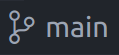

This exercise will walk you through the process of making a contribution to a third-party repository via a *pull request* on GitHub.

<!--more-->

It is assumed that you don't have the right to edit the repository directly, so the only way to make a contribution is via a *pull request*.

In order to demonstrate this, we have created a shared project on which we can practice.
It currently looks like this:


You can view [the live page] for the project.

Your task is to follow the appropriate workflow to make a simple pull request to the site.

> This website will be created collectively by hundreds of students each making small updates.
Make your contribution stand out by adding some styles.
> The module leader reserves the right to reject your contribution if it breaks the rules.

## Setup your repository

Before making any contributions, you need to **fork** the repository on GitHub and then **clone** it to your local machine.


### Fork the *upstream* project

This step happens in the [i-was-here] repository page on GitHub.
Since you don’t have direct edit access, you need to create a **fork**, which is your personal copy of the repository.

Click the **Fork** button at the top right of the [i-was-here] repository page.

> Visit the [i-was-here] repository.
>There should be a banner in the source repository that should look something like this.
>
>
>
> Notice there is a **fork** button.
> Clicking the button creates a **fork** of the project.

You should be taken to your newly created repository.
This is a copy of the *upstream* repository, owned by *you*.

>The new repository will belong to your GitHub user account and it should point to the source repository like this.
>
>
>
> Notice it says, *"forked from web-development-DMU/i-was-here"*

With your own copy of the code, you can make commits freely without conflicting with other developers.
This is where you will publish your changes before submitting them for review.

### Cloning your fork


Now that you have a fork, you need to **clone** it to your local machine so you can work with the code.

1. Open VSCode.
2. Press *Ctrl + Shift + P* to open the command palette.
3. Type *"clone"* and select **Git: Clone**.
4. Choose **Clone from GitHub**.
5. Select your **forked** repository (not the original upstream one).
6. Pick a folder on your computer to store the project.

> If you have trouble, ensure you are logged into GitHub and that your fork exists.

After cloning, open the project folder in VSCode. Now you’re ready to start contributing!

## Making a contribution

Once you have a local copy of the **i-was-here** project open in VSCode, you can explore the code and run *live server* to review the site.

>**Don't make any changes yet.**
You **must** keep your *main* branch clean.
It should **always** reflect the state of the *upstream* repository without any of your local changes.
>
> We shall see that our changes can make their way into the *main* branch via github if they are accepted into the *upstream* project.

### Branching

Create a new branch named with your student number.


> At the bottom of the VSCode window, you should see a git icon with the name of the current branch.
>
>
>
>If you click this icon, you should open the branching interface with options to create a new branch.
>
>
>
> Switching between branches is now easy, using this interface.

Creating a new branch for our changes allows our code to diverge from the *main* branch.

With your new branch activated, take some time to make your changes to the HTML and the CSS.
You should 'go live' and take some time to get the result you want.
You can add as many commits as you need.
Make sure its nice and tidy and doesn't break any of the rules.

### Pushing

Once you are happy, make sure everything is committed to your new branch so you have a clean working copy.

Now synchronise your repository with your GitHub fork.

> This will involve publishing the new branch, just press the **Sync Changes** button as before.

This should create a copy of the new branch on your github fork of the project.

### Creating a pull request

The only way to make contributions to the code is by creating a **pull request**.

> A pull request is a link to a version of the code with updates.
The repository owner(s) can choose to merge a pull request into the code.
> This is typically how you would make a contribution to an open-source project. 

The first step is to create your own personal **fork** of the *upstream* project on GitHub.
Visit the [i-was-here] repository and click on the **fork** button in the GitHub interface.


Now we are at the final stages of the process.
Go to GitHub, you should see your updates have been uploaded.

> The interface should show you that you have some new changes and give you the option to create a pull request
> 
> It might be like this:
> 
>
> 
> In which case, click the button to start the process.
> 
> Or it might be like this:
> 
>
> 
> In which case, click the **contribute** button and create the pull request.

Review the pull request, scrolling down the page you should see the diff.
This is what will be seen by the project owners.
Add any comments you think are necessary and create the pull request.

At this point you will need to wait for the pull request to be accepted.
This may take several days.

## Clean up

Once the pull request is accepted and merged, our repositories are left in a messy state. 

We should do some tidying to get ready for another contribution.

1. Update our GitHub fork from *upstream* and delete the remote branch.
1. Update our local repository and delete the local copy of the merged branch. 

### Updating our GitHub fork

Return to your GitHub fork and pull in the changes.

> You should see a banner on the *main* branch showing that your fork is behind the upstream repository.
>
>
>
> If the **Sync fork** button is available, click it and then **Update branch** to pull in the latest changes.
>
> If you don’t see this button, you can manually sync your fork using the command line:
> ```sh
> git remote add upstream https://github.com/web-development-DMU/i-was-here.git
> git fetch upstream
> git merge upstream/main
> git push origin main
>```
> This creates a direct link between your local repository and the **upstream** repository. 

Keeping your fork updated ensures that you’re working with the latest code. 
Always sync before starting a new contribution.

This is why it is a good idea to leave the *main* branch untouched and **always** make our changes on a fresh branch.
This ensures any new commits can always be pulled without any problems and we have a direct copy of the *main* branch from the *upstream* repository.

Finally, we can delete the branch we used for development so we can begin again with a clean set up.
The interface should be clear enough.

> Click the **branches** button. 
>
>
>
> Find your development branch and delete it.

### Updating our local repository

In VSCode we can now checkout the *main* branch and synchronise it with GitHub, pulling the changes into our local repository.

We can also delete our development branch to leave us with a clean environment, ready to repeat the process.

>VSCode allows this through the command palette.
>
> - Press *Ctrl + Shift + P* to open the command palette.
> - Type *"delete"* and select the option for *"Git: Delete branch"* 
> - Select your development branch

## Claiming your assignment repository

Now you have been through the process with our demonstration repository, you can use a similar approach with your assignment repository.

- Go to learning zone and find the invitation link.
- Create your group and join with up to two colleagues.
- An shared group repository will be created for you.
- Each group member should probably take a clone and issue pull requests.

The only difference here is that you will be in charge of accepting and merging the pull requests.
So please make sure you discuss this with your colleagues and decide on a procedure.


## Advanced setup

A couple of things that you may find helpful.

### Prune on fetch

By default VSCode will keep a list of old remote branches, even after they are deleted from GitHub.
There is a command *"Git: Fetch(Prune)"* in the command palette which will prune these branches from the list.
Doing this occasionally is great.
However, you can configure your VSCode to do this automatically by checking *"Git: Prune on fetch"* in your settings (*Ctrl + comma*).

### Link directly to upstream

It can be annoying and slow to pull updates from the upstream repository through our GitHub fork and down to our local repository in VSCode.
If you know what you are doing, then you can add a new *remote* to your local repository using the command palette to find the *"Git: Add Remote..."* command.
Find the upstream repository and name it *"upstream"* (your fork of this is a remote known as *"origin"*).

Now you can pull directly from upstream into the *main* branch by first selecting the *main* branch and then use the command palette to find the *"Git: Pull from..."* command which should then allow you to select the *upstream* repository and pull from the *main* branch.

<br>.

<br>.

<br>.

<br>.

<br>.

---

> Git is a complex tool and there are many resources which explain branching.
If you are interested in understanding git more deeply then read about [git branches].
For a higher-level overview read about [GitHub branches].


## Create and clone your assignment repository

You may have already created your assignment repository, if not then **follow the link to the GitHub classroom under the Assessment Tab**.
Find your P-number from the (sorry, very long) list.
This will generate a repo with simple starter code.

The repo for your assignment code is private and is owned by the CTEC3905-2022 organisation.
Your GitHub user has permissions to edit it, so it can be viewed only by you and module staff.

Now **clone this repo to the computer on which you are working**.
You can now push any work you do on your assignment to this repo.

## 03 Lab learning outcomes


- Use GIT to clone a repository from GitHub
- use GitHub as a remote source for a local git repository
- get your assignment code repository set up

[github]: https://github.com/
[GitHub flow]: https://docs.github.com/en/get-started/using-github/github-flow
[i-was-here]: https://github.com/web-development-DMU/i-was-here
[the live page]: https://web-development-dmu.github.io/i-was-here/

[git branches]: https://git-scm.com/book/en/v2/Git-Branching-Branches-in-a-Nutshell
[GitHub branches]: https://docs.github.com/en/pull-requests/collaborating-with-pull-requests/proposing-changes-to-your-work-with-pull-requests/about-branches
