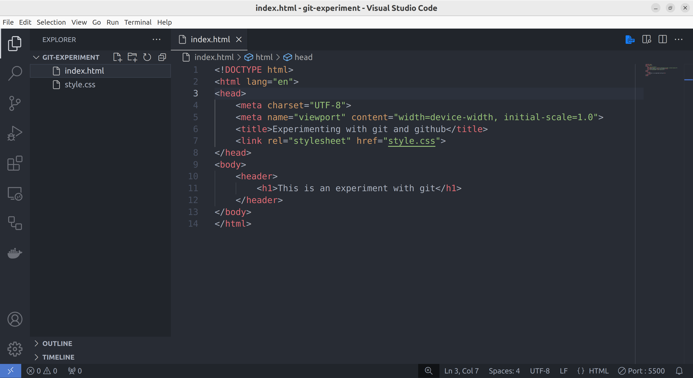
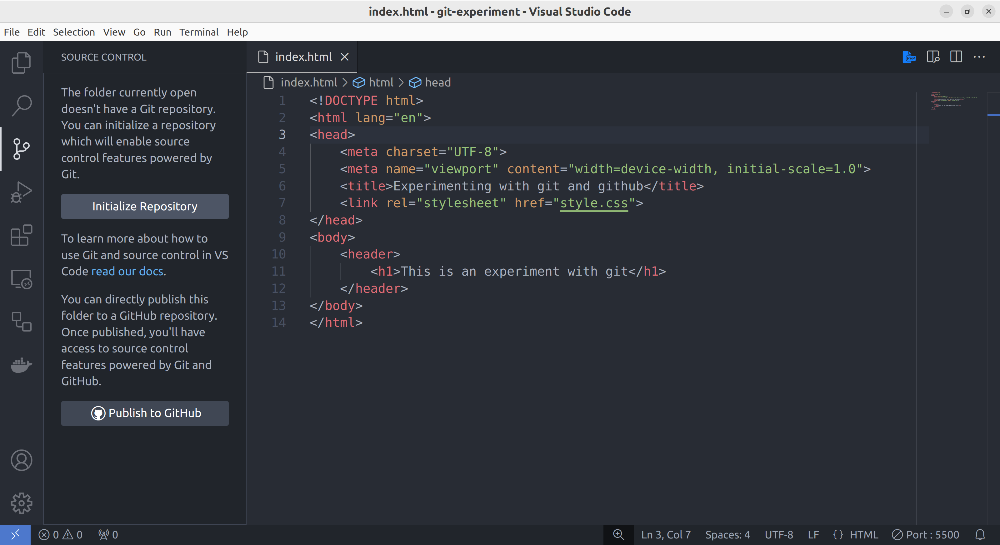
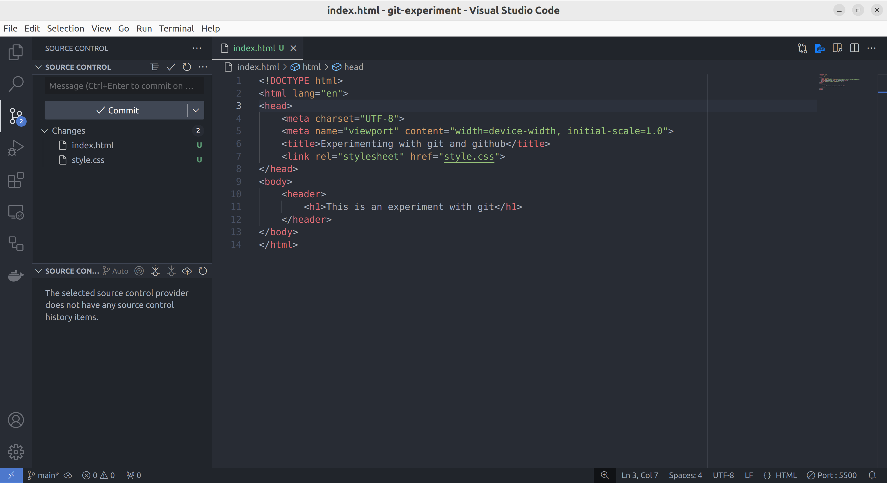
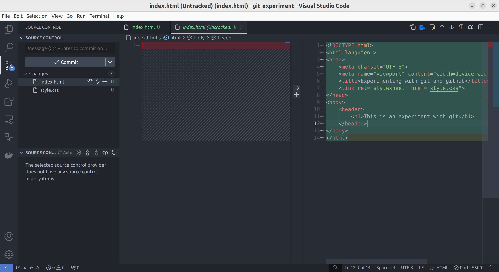
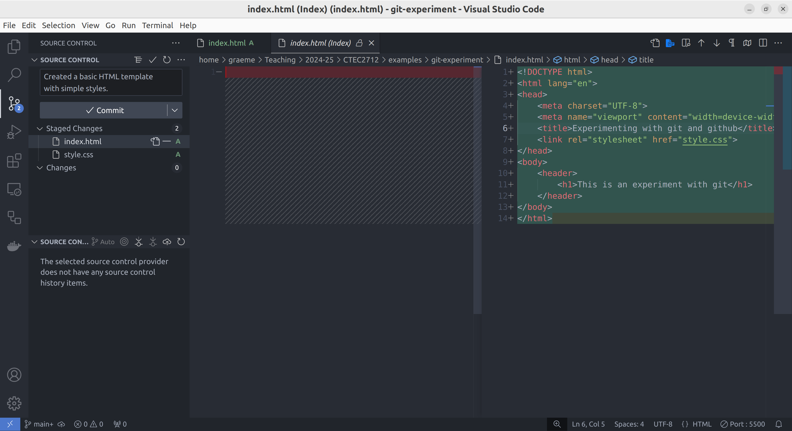
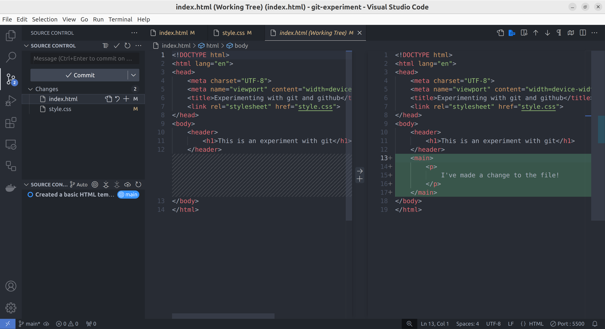
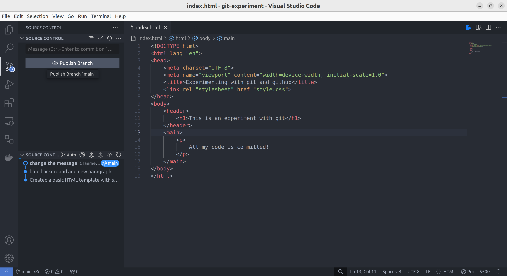
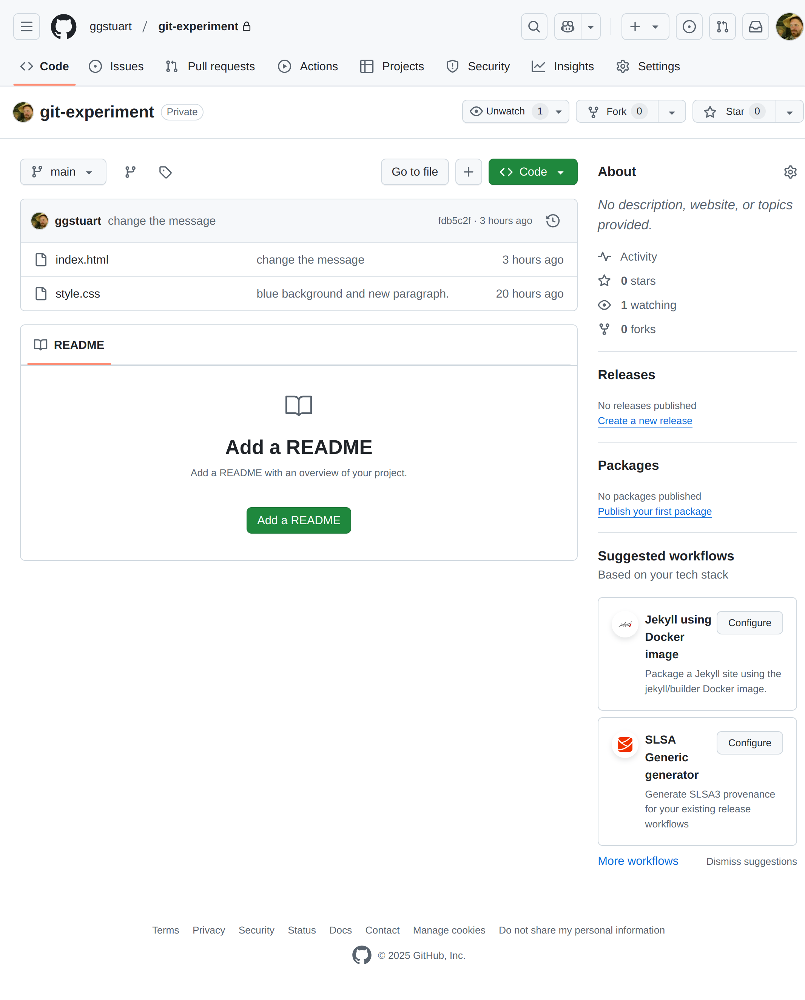
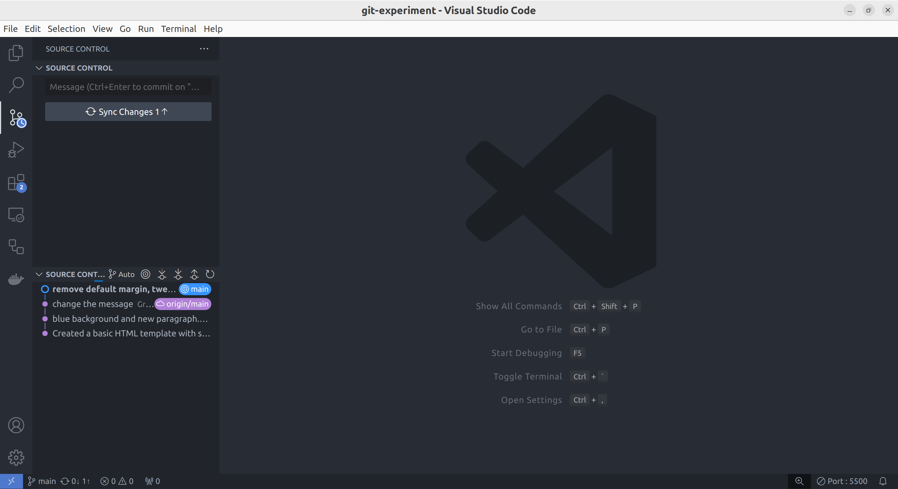

Git allows us to make incremental improvements to our code whilst also allowing free experimentation.
In this exercise we will introduce basic usage of GIT within VSCode.

<!--more-->

Git is software that allows us to store code safely and return back to previous saved versions.

> Have you ever broken some working code and not been able to get it working again?
> This is one of the key problems that version control solves for us.

## Create a new project

Create a new project with two files, an *index.html* and a *style.css*.

Your project should look something like this.

```markdown {linenos=false}
 CTEC2712
   └─ exercises
        └─ git-experiment
            ├─ index.html
            └─ style.css
```

The *index.html* file can contain anything you like. 
It doesn't matter for what we are doing.

>Perhaps this?
>
>```html
><!DOCTYPE html>
><html lang="en">
><head>
>    <meta charset="UTF-8">
>    <meta name="viewport" content="width=device-width, initial-scale=1.0">
>    <title>Experimenting with git and github</title>
>    <link rel="stylesheet" href="style.css">
></head>
><body>
>    <header>
>        <h1>This is an experiment with git</h1>
>    </header>
></body>
></html>
>```

Similarly, the *style.css* file can contain anything, git doesn't care.

>Maybe this?
>
>```css
>body {
>    font-family: system-ui;
>    background: #222;
>    color: #ddd;
>}
>```

Now, make **absolutely sure** that you have opened the *git-experiment* folder in VSCode.
**NOT** the parent folder.
You should see two files directly in the VSCode explorer panel like this.



> Notice on the left-hand side the top-level folder is *GIT-EXPERIMENT* in capitals.
This will be the folder that becomes a git repository in the next step.

## Initialise a new git repository

To convert our project into a git repository, we first need to open the **source control** panel as shown below. 

> Click the *git* icon which is the third icon down on the left hand side of the VSCode window. 



Since there is no git repository found in the current folder, we are presented with the option to initialise a new repository. 
Click the **Initialise Repository** button to create a repository.

> This button issues the `git init` command for us.

You should now see the **source control** panel shows two untracked files under *changes*.
The green **U** next to the filenames indicates that the files are **untracked**, i.e. they are not yet included in the repository.



We have successfully created a git repository.
From now on, whenever we want to see the state of our repository, we can use the **source control** panel.

### Viewing a **diff**

Select one of the files and you should be presented with a *diff* in two panels just as in the screenshot below. 
This shows the difference between the current **working copy** of the file compared to the latest saved version in our repository.

On the left side, the panel is blank, indicating that this file doesn't yet exist in the repository.
On the right side, you are shown the entire content of the file highlighted green, indicating these are all additional lines.



With a new file the diff isn't very interesting.
However, we shall see later that this view shows exactly what has changed since the last commit.

### Create our first commit

Notice that, in the source control panel on the left, we have icons next to each file name.
Hovering the mouse over these shows their purpose.

> This is the core functionality of git
>We have two main options:
>
> 1. We can **revert** our code to the last commit (i.e. delete the file in this case) or
> 1. We can **add** the changes into a new commit (i.e. prepare to save the changes into the repository).


Before committing, git requires that we place changes into a *staging area* ready to commit.

Add each file individually to the staging area using the little **＋** icon next to the file name.
When you do this, you should see the files move from *changes* to *staged changes*.

At this point we can add a commit message to explain what changes were made in the commit.



> Notice the message in the screenshot above, it's at the top of the *source control* panel.
>```markdown {linenos=false}
>Created a basic HTML template with simple styles
>```
>It is good practice to add a simple message to every commit.
>Over the course of a project, these messages accumulate into a long list of messages explaining the evolution of the code.


The staged changes will create a commit when we press the *commit* button.
If you haven't done so, stage both files, enter a message and make the commit by pressing the button. 

### A second commit

Now we can edit our code (known as our **working copy**) and see how our edits compare to the most recently committed version.
Go back to the **explorer** panel and make changes to both files. 
Check the **source control** panel again and you should see your changes are highlighted in the diffs.

> Switching between the different VSCode panels should become a habit. 
The icons on the left of the VSCode window are not all as useful as the *source control* and *explorer* panels.




Before we make a commit, we can move the files in and out of the commit by clicking the icons next to the file name.
A commit should contain related changes which increment the project in some way.
Typically, a commit should not leave the project in a *broken* state.

> We don't need to add all our changes into the next commit, we could add one file at a time or even construct commits line-by-line.
> Highlighting some of the green lines of code and right-clicking reveals these more advanced options.
> Don't worry about this now, but know that if you have lots of unrelated changes in your **working copy**, it is possible to divide the changes into multiple commits in this way.

Make a second commit by staging the files, entering a message and clicking the commit button.
This process can continue indefinitely. 
Each commit acts as a save point to which you can revert if necessary.


### Reverting

Go back to the *explorer* panel again and make a few more changes, to both files. 
Check the *source control* panel again and you should see your changes are highlighted in the diffs as usual.

This time, for each file, choose the **revert** option.

You should see that the project returns back to the last commit.

> This is crucial as it allows you to experiment freely, safe in the knowledge that you can always revert back to the last save point.
> Just remember to commit early and commit often when things are going well.
>
> The usual workflow is to edit the **working copy** until an incremental improvement is complete.  
Then we can check the *diff* to see what we are about to commit, tidy up any mess in the new code and make the commit.
>
>It is good practice to make your commits as simple as possible (but no simpler).
Leaving unrelated uncommitted changes in the **working copy** can lead to problems.


### Where are the commits?

So far we have been working entirely locally. 
Git is sophisticated software, but ultimately, all it is doing is creating extra data in a hidden *.git* folder within your project folder.

The *.git* folder contains an index of all the files in your repository and all the information about every commit (stored as a sequence of *diffs*).

> You can see this folder if you know how to show hidden files.
**Do not mess with the contents of this folder**.

This means you can move your project folder anywhere on your file system and it will still be identified by VSCode as a git repository and all the commits will still be intact.
Git will also be able to see the difference between your **working copy** and this stored data.


Make a few more commits to your project until you are happy with it. 

> Remember, lots of small, incremental changes in the commit history is much better than fewer larger changes.

## Publishing

> **You will need a github account for this step.**
If you do not have one, go and set one up at [github].
If you do have an account then make sure you are logged into github in your browser.


If you have committed all your changes then you should see a **Publish Branch** button appear in the VSCode **source control** panel.




> If you don't see this button then perhaps you need to commit or revert some uncommitted changes in your **working copy**.

This button will trigger VSCode to make a **clone** of our repository (a full copy, including all the commit history) on *github*.
It will also register this copy as a **remote** repository.
So our local repository will store a link to the new repository on github and this will establish a connection between the two copies of our repository.


Now, **click the publish button** to upload your repository.

> You may be asked to authenticate with github.
Additional windows may pop up to enable a login process. 
Agree and let the process complete.

You will be asked whether you want to create a *public* or *private* repository. 
Choose a *private* one for now (you can make it public or share it with specific people later).
Feel free to rename the repository if you want.


Now, if everything worked as expected, you should be able to find the new repository, including a record of all your commits on [github].



> Note that we could have clicked the **Publish to GitHub** button in the first place instead of the **Initialise Repository** button. 
This would initialise the local repository, make an automatic commit of all the changes and clone it to github all in one step.

### Ongoing changes

Now, back in VSCode, you can make further commits to the local repository and when your **working copy** is up to date (i.e. once everything is committed), you should now see the option to **Sync Changes** indicating how many commits we have locally that would be **pushed** to the remote repository.

> This has replaced the **Publish Branch** button.



Simply clicking the button will push any new changes to [github].

>You may need to refresh your browser to see the updates appear on the github website.

## Conclusions

We have introduced the basic of git. 
There is a lot more to learn but we can now confidently create repositories, make commits and publish out code on github.


[github]: https://github.com/
[github flow]: https://docs.github.com/en/get-started/using-github/github-flow
[i-was-here]: https://github.com/web-development-DMU/i-was-here
[the live page]: https://web-development-dmu.github.io/i-was-here/

[git branches]: https://git-scm.com/book/en/v2/Git-Branching-Branches-in-a-Nutshell
[github branches]: https://docs.github.com/en/pull-requests/collaborating-with-pull-requests/proposing-changes-to-your-work-with-pull-requests/about-branches
