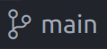

Working on a group project requires a more sophisticated workflow.
This exercise presents a simple approach you can use for your assignment.

<!--more-->

We will cover creating your repository, cloning it from github and a simple branching workflow for creating pull requests.

## Creating your repository

For the assignment, the code will be managed in GitHub classroom.
Before you begin work on your project, you will need to create your official repository.

You must find the **GitHub classroom invitation link** on learning zone.
It should be advertised widely and clearly indicated under **assessment**.

> You will need a GitHub user account for this step. 
If you have one, log into it.
If you don't have one, create one.

Clicking the link should lead you to a list of students.
Find your name in the list.

> If your name does not appear in the list then get in touch with the module leader immediately and they will add your name to the list.

You will then be presented with the option to join or create a team.



> Be very careful to coordinate with your team here. 
The system will limit teams to four members maximum.
Additional team members will need to be requested via the module leader once you have a team name. 
>
>If you don't have a team in mind then you can visit the learning zone discussion board and find a team to join.

Each team will automatically be allocated a repository which will be owned by the `web-development-DMU` organisation and your GitHub user will be given write access.

The repository might look a bit like this, it should have some starter code in place but nothing particularly useful for your project.



## Cloning the repository

Each team member should now create their own local **clone** of the group repository.

> This will copy it to your local machine so you can work with the code.

1. Open VSCode.
2. Press *Ctrl + Shift + P* to open the command palette.
3. Type *"clone"* and select **Git: Clone**.
4. Choose **Clone from GitHub**.
5. Carefully type *"web-development-DMU"* and select your team repository.
6. Pick a folder on your computer to store the project.

> If you have trouble, ensure you are logged into GitHub, that your repository has been created and that you have joined the team as described above.

After cloning, open the project folder in VSCode. 





## Making contributions

Now you’re ready to start contributing!

> **Don't make any changes yet.**
>
>Each team member can practice making their first contribution by adding their student number into the *README.md* file.
>
>We will describe the process and then go through an example.

**All** contributions to the project should be made via **branches**, taken from *main*.
The process is as follows:

1. Make sure the *main* branch is up to date (pull the latest changes)
2. Create a *feature branch* for your work, based on the *main* branch
3. Make commits on the *feature branch* until the feature is ready
4. Push the *feature branch* up to GitHub
5. Perform a merge into the *main* branch on GitHub via a **pull request**

These steps can be repeated for each new feature.

> Be careful to coordinate with your team mates.
> Once a pull request is merged, everyone will need to pull the new code and merge with any local changes they are working on.
>
> Try to avoid working on the same code as your team mates at the same time to ensure merges go smoothly.

### STEP 1: Updating the *main* branch

The *main* branch will be used as a record of the current version of the team code.
You must **always** keep your *main* branch clean without any local changes and update it regularly by pulling changes from GitHub.

- The main branch is how code comes into our project.
- Merges happen on GitHub via pull requests
- We pull these changes into our local copy of *main*

> If you commit to the *main* branch, then you will diverge from the project and could cause major headaches for your team.

You should regularly pull in changes from GitHub.

> VSCode will show you when it finds updates, or you can use the command palette like this:
> - Switch to the *main* branch
> - Press *Ctrl + Shift + P*
> - Type *"Git: Pull"*
> We will show you how to switch branches below.

### STEP 2: Creating a feature branch

The next step is to create a feature branch.
Typically named after the feature you will be implementing.

> Branches are cheap to create, you should get used to creating and deleting branches all the time.

As an example, we will work with a branch *my-branch* which will be used to modify the readme file.
You will choose a better name, such as *feature-view-programme-list* or *feature-add-new-staff* depending on what you are doing.

At the bottom of the VSCode window, you should see a git icon with the name of the current branch.

<!--  -->

If you click this icon, you should open the branching interface with options to create a new branch.




Select *Create new branch...* and enter your branch name.

> The above interface makes switching branches easy.
> Make sure you have switched to the *main* branch before you create your feature branch.
> 
> If you have old branches that are no longer being used, consider deleting them to keep the list tidy.

### STEP 3: Make the updates

You can now make changes and commit them to the new branch.




Add as many commits as you need in this step.

### STEP 4: Push your branch to GitHub

Once the changes are committed to your feature branch, then you can push the changes to GitHub.



> For newly created branches, the interface should include a *Publish branch* button as in the above image.
Further commits can be added by synchronising (there should be a *Sync Changes* button instead as in the below image).
> Avoid working on the same branch as your team mates unless you know precisely what you are doing.



### STEP 5: Merge the code via a *pull request*

Go to GitHub, you should see your updates have been uploaded as a new branch.



> Clicking the left-most option should confirm that *my-branch* has been uploaded.

Select the *pull requests* menu item.
 


Click the *New pull request* button and select *my-branch* as the *compare* branch.

You should see something like this showing all the differences.



If you are happy to continue then click **Create pull request** and add any comments you think are necessary.

Eventually you should be presented with the option to merge.
This is what will be seen by your team mates.
At this point you should communicate with your team and ask for someone to check it over.
They may add comments or make suggestions.
Add more commits if necessary, just go back into VSCode, make more commits and synchronise them with github.

> The pull request will update since it represents a *diff* between the two branches.
If you add more to *my-branch* then it will be included in the pull request automatically.



Once you (and your team) are happy, merge the pull request.
This will add a new commit onto the *main* branch which merges your work.
You will be asked to enter a commit message.

Once its merged, you can delete the branch.



## Handling merge conflicts

If you edit the same part of a file in two branches then you will probably get a merge conflict.
To resolve a merge conflict you will need to create one more commit that decides what code (if any) is taken from each branch.

Pull down the latest *main* branch changes from github.

- Switch to the *main* branch
- Press *Ctrl + Shift + P*
- Type *"Git: Pull"*

Now you will need to merge these changes into your feature branch locally.

- **Switch to the *my-branch* branch** (important)
- Press *Ctrl + Shift + P*
- Type *"Git: Merge"*
- Select the *main* branch

> Don't panic!
Now you should see the problems highlighted. 

This video should help you resolve the conflict.
Basically you need to decide what changes to keep and what to remove.



Once the merge has completed, you can push the new commit up to github and complete the pull request.

## Keeping tidy

Deleting old branches once they are merged or abandoned really helps to keep the project organised.
Once a pull request is merged, you usually are offered the opportunity to delete the merged branch.

If you forget to do this, don't worry. 
The branches interface on GitHub makes deleting old branches simple.

Locally, VSCode allows this through the command palette.

- Press *Ctrl + Shift + P* to open the command palette.
- Type *"delete"* and select the option for *"Git: Delete branch"* 
- Select your *my-branch* branch

By default VSCode will keep a list of old remote branches, so it may keep links even after they are deleted from GitHub.
There is a command *"Git: Fetch(Prune)"* in the command palette which will prune these branches from the list.
Doing this occasionally is great.
However, you can configure your VSCode to do this automatically by checking *"Git: Prune on fetch"* in your settings (*Ctrl + comma*).
