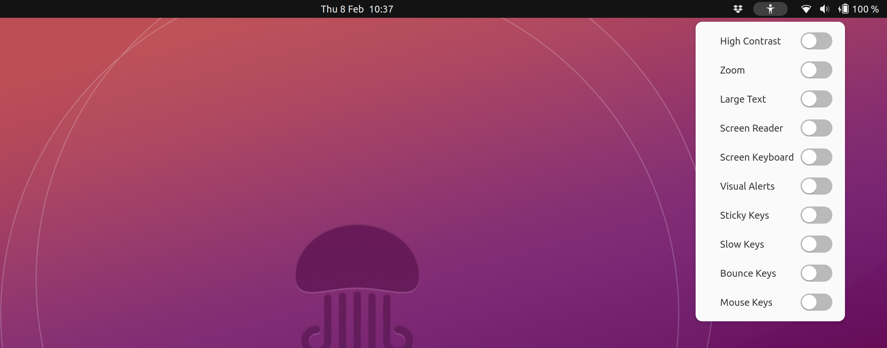

In this module we consider accessibility as a foundational design goal for building high quality HTML documents representing our application interface.
<!--more-->

Considering the accessibility of your HTML will typically lead to a better overall design and will often lead to a document that is easier to style for the browser.
Moreover, if your site doesn't take accessibility into account, then you are preventing users of assistive technology from accessing your content.

## What do we mean by accessibility?

If software can understand the semantics (i.e. the meaning) of your document then it can provide this additional information to the user as necessary. 
For example, assistive technologies need to be able to access your document structure so they can provide users with navigation tools.



## Accessible Rich Internet Applications

When building HTML documents, there are techniques we can use to structure the content with the proper semantics and include additional information.
These are known as the [Accessible Rich Internet Applications](https://www.w3.org/WAI/standards-guidelines/aria/) standards (or simply ARIA for short).
ARIA provides us with attributes we can add to our HTML elements to give assistive technologies more information.

In particular, the **role** attribute can be used to describe the semantics of widgets and structural elements in your page.
Often used with other attributes to provide more detail.

We can add the role attribute manually to any element.
A good example is the *heading* role which indicates to assistive technologies that an element should be treated like a heading.

We can use any element (such as a `<div>`) to create a heading like this.

```html
<div role="heading" aria-level="1">This is a main page heading</div>
```

the *aria-level* attribute tells the assistive technologies which part of the page structure the element represents.
However, the same result can be achieved by simply using the correct semantic element, in this case an `<h1>` element.

```html
<h1>This is a main page heading</h1>
```

The above code examples are semantically identical but the second example is clearly more convenient, easier to read and generally much better.

For the most part, using semantic HTML elements (e.g. `<header>`, `<ul>` or `<section>`) rather than meaningless elements (e.g. `<div>` or `<span>`) will automatically provide the necessary ARIA roles to describe the structure of your document for assistive technologies to parse up your content and present it in a meaningful way to users.

> Always use the correct semantic elements for your content.
> It's not difficult and there are often multiple choices.
> Make sure you only use generic elements such as `<div>` or `<span>` elements when they don't carry any semantic meaning.

## Examples

To explore these examples in detail you will need to activate screen reader software.

> Windows has a built in screen reader known as [narrator](https://support.microsoft.com/en-gb/windows/complete-guide-to-narrator-e4397a0d-ef4f-b386-d8ae-c172f109bdb1) which can be started like any other programme.
>
> On ubuntu the screen reader can be accessed from the accessibility menu.
>
> 
>
> The accessibility menu can be activated in **settings** under *accessibility*.


There are three very common cases where accessibility concerns impact your choice of HTML code directly.

1. Images and alternative text
1. Basic page structure
1. Labelling inputs

We will now attempt to use a screen reader to demonstrate the impact of using the correct semantic elements and adding the necessary attributes. 


### Images and alternative text

Images are added to a site using the `` element. 
The `` element must include a `src` attribute pointing to the url of an image file.

Create the following document and load it in the browser.

```html
<!DOCTYPE html>
<html lang="en">
<head>
    <meta charset="UTF-8">
    <meta name="viewport" content="width=device-width, initial-scale=1.0">
    <title>Accessibility examples</title>
</head>
<body>
    <header>
        <h1>Images</h1>
        <p>
            Images are a good example of content where accessibility concerns are an important factor.
        </p>
    </header>
    <main>
        <h2>An example of poor accessibility</h2>
        <p>
            The following image is essentially invisible to a screen reader.
            We can tell there is an image, but we have no idea what it is showing.
        </p>
        
    </main>
</body>
</html>
```

In the browser, the image shows perfectly normally, but the document is actually invalid.



For a valid document and for accessibility, `` elements must have an `alt` attribute which provides a text description that can be used as an alternative to the image for those who cannot see it.

The alternative text will be *announced* by a screen reader.
An image with no `alt` attribute will be announced as **"unlabelled image"** within the flow of the document.

> Try accessing the document with a screen reader.
> The experience is frustrating, the image is acknowledged but we have no information about it.

If we add an empty `alt` attribute then the image is effectively ignored by the screen reader. 
This is an acceptable strategy where images are used as meaningless decoration. 

```html { hl_lines="16-21" }
<!DOCTYPE html>
<html lang="en">
<head>
    <meta charset="UTF-8">
    <meta name="viewport" content="width=device-width, initial-scale=1.0">
    <title>Accessibility examples</title>
</head>
<body>
    <header>
        <h1>Images</h1>
        <p>
            Images are a good example of content where accessibility concerns are an important factor.
        </p>
    </header>
    <main>
        <h2>A hidden image</h2>
        <p>
            This image has an empty <em>alt attribute</em>.
            Notice the impact this has on the screen reader.
        </p>
        
    </main>
</body>
</html>
```

The page is identical in the browser, but the document will now validate.



> To the screen reader, the image is gone.

Usually we want the user to know there is an image and we want them to have a sense of what the image shows.
For this, we can add a simple description as the `alt` attribute.
The description will be announced by the screen reader when the image is reached in the document.

```html { hl_lines="16-21" }
<!DOCTYPE html>
<html lang="en">
<head>
    <meta charset="UTF-8">
    <meta name="viewport" content="width=device-width, initial-scale=1.0">
    <title>Accessibility examples</title>
</head>
<body>
    <header>
        <h1>Images</h1>
        <p>
            Images are a good example of content where accessibility concerns are an important factor.
        </p>
    </header>
    <main>
        <h2>An example of good accessibility</h2>
        <p>
            This next image is much better because it has a non-empty <em>alt attribute</em>. 
            The alternative text briefly describes the image for users who cannot see it.
        </p>
        
    </main>
</body>
</html>
```

Again, this has no effect in the browser, the three sites appear identical.



However, to the screen reader there is a big difference between the three options.

> Try it, the image is announced by the screen reader and the user gets the best experience.

So make sure you add a sensible `alt` attribute for every image in your document.
Add empty `alt` attributes only for images which are not part of the content.


### Basic page structure

Imagine a large document on the web, something like this page but even larger.
The user should be able to quickly scan through the various sections and headings to find what they are looking for.
However, using very bad practice, it's possible to create a document that is impenetrable.

Here's a good example of **what not to do**.
Using all the wrong elements to structure our page.

```html
<!DOCTYPE html>
<html lang="en">
<head>
    <meta charset="UTF-8">
    <meta name="viewport" content="width=device-width, initial-scale=1.0">
    <title>Poor</title>
</head>
<body>
    <div id="container">
        <div>The main page heading</div>
        <p>This article is about showing a page structure.</p>
        <div>Introduction</div>
        <p>An introductory text.</p>
        <div>Chapter 1</div>
        <p>Text</p>
        <div>Chapter 1.1</div>
        <p>More text in a sub section.</p>
    </div>
</body>
</html>
```

It is difficult to follow the structure of the resulting page because the headings are not visually distinct.
The same is true when using a screen reader.



We can add the necessary ARIA *heading* roles explicitly.
By giving each heading an *aria-level* attribute, we are providing a structure that can be announced by screen readers.

```html
<!DOCTYPE html>
<html lang="en">
<head>
    <meta charset="UTF-8">
    <meta name="viewport" content="width=device-width, initial-scale=1.0">
    <title>Better</title>
</head>
<body>
    <div id="container">
        <div role="heading" aria-level="1">The main page heading</div>
        <p>This article is about showing a page structure.</p>
        <div role="heading" aria-level="2">Introduction</div>
        <p>An introductory text.</p>
        <div role="heading" aria-level="2">Chapter 1</div>
        <p>Text</p>
        <div role="heading" aria-level="3">Chapter 1.1</div>
        <p>More text in a sub section.</p>
    </div>
</body>
</html>
```

This change makes a big difference to assistive technologies, but the page would need some additional styling to reveal the structure visually.



The above may seem complicated. 
Luckily, we can achieve exactly the same result by using the proper semantic elements. 
In this case the `<h1>` to `<h6>` elements all provide the *heading* role and have the *aria-level* baked in.  

```html
<!DOCTYPE html>
<html lang="en">
<head>
    <meta charset="UTF-8">
    <meta name="viewport" content="width=device-width, initial-scale=1.0">
    <title>Good</title>
</head>
<body>
    <div id="container">
        <h1>The main page heading</h1>
        <p>This article is about showing a page structure.</p>
        <h2>Introduction</h2>
        <p>An introductory text.</p>
        <h2>Chapter 1</h2>
        <p>Text</p>
        <h3>Chapter 1.1</h3>
        <p>More text in a sub section.</p>
    </div>
</body>
</html>
```

Not only is this version easier to write, it also has both visual and semantic meaning built in so it provides all users with information about the structure of the page.




If we want to add more structure still, we can bring in some more content sectioning.

```html
<!DOCTYPE html>
<html lang="en">
<head>
    <meta charset="UTF-8">
    <meta name="viewport" content="width=device-width, initial-scale=1.0">
    <title>Structured</title>
</head>
<body>
    <header>
        <h1>The main page heading</h1>
        <p>This article is about showing a page structure.</p>
    </header>
    <main>
        <section aria-labelledby="intro">
            <h2 id="intro">Introduction</h2>
            <p>An introductory text.</p>
        </section>
        <section aria-labelledby="ch1">
            <h2 id="ch1">Chapter 1</h2>
            <p>Text</p>
            <h3>Chapter 1.1</h3>
            <p>More text in a sub section.</p>
        </section>
    </main>
</body>
</html>
```

The above example has added a `<header>` around the main heading and description.
The rest of the document is wrapped in a `<main>` element. 
The introduction and chapter 1 are wrapped in `<section>` elements to give them each a [*region* role](https://developer.mozilla.org/en-US/docs/Web/Accessibility/ARIA/Roles/region_role).
In order to do this properly, we needed to label each section, this can be done using the *aria-label* attribute to provide a label directly, however, since we have out `<h2>` elements, we can use these as the labels by giving them *id* attributes and using the *aria-labelledby* attribute on our `<section>` elements.

We have added a bit more semantic structure to the document and this has had an impact on what a screen reader sees. 

However, notice that visually, the site still looks exactly the same.




This extra structure in the HTML has a few other benefits. 
Firstly, it helps the HTML author to visually navigate around the document because the indentation level is closely related to the document structure.
Text editors such as **vscode** allow elements to be optionally [*folded and unfolded*](https://code.visualstudio.com/docs/editor/codebasics#_folding), this can become important with large and complex documents.

The additional elements can also be used for styling the page with CSS.

> We will investigate styling in a lot more detail in upcoming exercises

### Labelling inputs

The `<input>` element is used to receive user input.
Adding an input element is as simple as this.

```html
<!DOCTYPE html>
<html lang="en">
<head>
    <meta charset="UTF-8">
    <meta name="viewport" content="width=device-width, initial-scale=1.0">
    <title>Basic</title>
</head>
<body>
    Enter your name: <input>
</body>
</html>
```

The result is a box which allows users to enter a name.



Sadly, assistive technologies will not be able to link the text with the input.

Using `<input>` elements is a large subject and we will cover more detail later. 
For now, we will explore ways to provide labels which will be associated with inputs.  


## Conclusions
