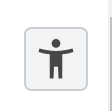

In this exercise we will look at the default styles applied by the browser and how the main element types behave.

<!--more-->

When elements are included in a document they automatically inherit some default behaviour.
Some elements are given additional styles by the browser.
These styles can then be overridden and expanded by adding CSS rules.

Let's take a few moments to see how various elements behave by default, without any additional style information.
Starting with the basic VSCode template, you should have something like this.



## Simple text

The most basic content is just text, without any tags.
Try adding just some text, directly inside the `<body>` element. 

> This was added using the emmet command `lorem5*5` to produce five lines of *lorem ipsum* text, each line being five words long.

```html {hl_lines="6 9-13"}
<!DOCTYPE html>
<html lang="en">
<head>
    <meta charset="UTF-8">
    <meta name="viewport" content="width=device-width, initial-scale=1.0">
    <title>Adding content</title>
</head>
<body>
    Lorem ipsum dolor sit amet.
    Enim nulla molestias pariatur corrupti.
    Dicta vero quasi atque veritatis.
    Quaerat sunt similique laudantium architecto.
    Ut sunt voluptates molestiae eos?
</body>
</html>
```

Line breaks and multiple spaces are ignored.
You can add the text all in one line if you want.
I prefer to put one sentence on each line when I have lots of text.
Though I sometimes break longer sentences across multiple lines.

I also changed the content of the `<title>` element, which is good practice.

To view your document in a browser you can install [the live server extension](https://marketplace.visualstudio.com/items?itemName=ritwickdey.LiveServer) in VSCode.

>**Live server**
>
> On the left side of your VSCode window, select the *extensions* icon (usually the bottom icon) or press *Ctrl + Shift + X*.
>
> Search for "live server" and click the "install" button.
> 
>
> It will take a few moments to install.
> Once installed you should see a small "Go Live" button has appeared at the bottom of your VSCode window.
>
> 
>
> Clicking this will start a simple HTTP server that will serve your project and open a browser tab pointing to the selected file.
>
> The server root will be the top-level folder open in VSCode and is usually available at [http://localhost:5000](http://localhost:5000), though this can be configured.

The result is a single, flexible chunk of text.



Notice a few things.

 - There is a small gap between the text and the edge of the viewport.
 - There is a default *font-family*, *font-size*, *color*, etc.
 - Each of the newline characters has been reduced to a single space.
 - The text wraps to multiple lines if there isn't enough room.



### Default styles

Open the developer tools in your browser.

> *F12* usually works for me, there are many other ways as we saw in a previous exercise.

It's often useful to expand the width of the developer tools panel as a simple means to reduce the width of the viewport within which your document is rendered.
It also allows us to give more space to the style information in the *elements panel*.



Selecting an element in the *elements panel* will highlight the element location in the viewport.

> Alternatively pressing *Ctrl + Shift + C* will enter *inspect element mode*.
Subsequently, clicking on any element in the page will highlight it in the *elements panel*.

In this case we have selected the `<body>` element which wraps the entire page.

Notice the text is highlighted with a blue rectangle.
This is the **content** of the element.
The orange border around the text indicates that the `<body>` element has a **margin**.

The diagram in the styles panel also shows the size of the content (*width* x *height*) and the size, on each of the four sides (*top*, *bottom*, *left* and *right*) of the various *box properties* (*padding*, *border* and *margin*).
In this case, we can see that each side of the `<body>` element has *8px* of margin only.

Above the diagram, we can see that there are *styles* applied to the `<body>` element

```css
body {
    display: block;
    margin: 8px;
}
```

This explains the 8px *margin*.
It also sets the *display* property to *block*.

This is the *user agent stylesheet* applied by the browser, by default.
Different elements will have different default styles.

> [The Chrome default stylesheet](https://chromium.googlesource.com/chromium/src/third_party/+/master/blink/renderer/core/html/resources/html.css) includes hundreds of CSS rules. 

## *block* elements

All elements have a *display* property which determines how the element will behave.
The *display* property is set to *inline* by default (which we will see later), but the browser sets this value to *block* for many common elements.

> The difference between *block* and *inline* elements is critical to understand.

The `<body>` element is a so-called [*block*](https://developer.mozilla.org/en-US/docs/Glossary/Block-level_content) element.
Importantly, this means it will take up the full width of its container. 
In this case, the viewport itself is the container (or the `<html>` element, strictly speaking).

The default `margin` on the `<body>` element creates the *8px* gap between the text and the edge of the viewport.

A basic example of a *block* element is a `<div>`, these elements don't have any semantic meaning and they are often used to control layout, as we shall see in later exercises.
Since *block* elements take up the full width of their container, what would happen if we wrapped each chunk of text in a `<div>` element?

Let's try it.

```html {hl_lines="9-13"}
<!DOCTYPE html>
<html lang="en">
<head>
    <meta charset="UTF-8">
    <meta name="viewport" content="width=device-width, initial-scale=1.0">
    <title>Adding content</title>
</head>
<body>
    <div>Lorem ipsum dolor sit amet.</div>
    <div>Enim nulla molestias pariatur corrupti.</div>
    <div>Dicta vero quasi atque veritatis.</div>
    <div>Quaerat sunt similique laudantium architecto.</div>
    <div>Ut sunt voluptates molestiae eos?</div>
</body>
</html>
```

The result shouldn't be a surprise.
Each of our `<div>` elements takes up the full width of the `<body>` and so each `<div>` starts a new line.



We can see the only style which is applied to our `<div>` elements is to set the *display* property to *block*.
They have no *margin*.



If we reduce the viewport width then the text within each `<div>` wraps independently.



> Try using `<p>` elements (paragraphs) instead. 
Notice that they are *block* elements and have a *top/bottom margin*.

## *inline* elements

Elements where the *display* property is left as *inline* will flow like text. 
A basic example of an [*inline*](https://developer.mozilla.org/en-US/docs/Glossary/Inline-level_content) element is a `<span>`.
Just like `<div>` elements, `<span>` elements don't have any semantic meaning and they are often used to control specific pieces of text, as we shall see in later exercises.

What happens if we wrap each chunk of text in a `<span>` element?

Let's try it.

```html {hl_lines="9-13"}
<!DOCTYPE html>
<html lang="en">
<head>
    <meta charset="UTF-8">
    <meta name="viewport" content="width=device-width, initial-scale=1.0">
    <title>Adding content</title>
</head>
<body>
    <span>Lorem ipsum dolor sit amet.</span>
    <span>Enim nulla molestias pariatur corrupti.</span>
    <span>Dicta vero quasi atque veritatis.</span>
    <span>Quaerat sunt similique laudantium architecto.</span>
    <span>Ut sunt voluptates molestiae eos?</span>
</body>
</html>
```

Our `<span>` elements allow the text to flow just like in the original example.
So the span effectively does nothing by default.



We can see that no styles are applied to our `<span>` elements.

> Notice that the *display* property is not explicitly defined. 
In [the HTML specification](https://drafts.csswg.org/css-display/#the-display-properties) the [initial value](https://developer.mozilla.org/en-US/docs/Web/CSS/initial_value) for the *display* property is defined as *inline*.




However, the `<span>` does allow us to apply styles to specific bits of text. 

> Try changing one span to an `<a>` element (a hyperlink). 
> You will need to link to somewhere with an *href* attribute.
Notice that hyperlinks are *inline* elements, so they flow with text.
They also have a few other styles which change their *color*, *cursor* and *text-decoration* properties.

## Images

The web isn't only about text, we can also add *multi-media* images and video.



>The above image is served by [placekitten.com](http://placekitten.com), a service that can be used like *lorem ipsum* text to include placeholder images into page designs before the 'real' images are available.

Images are *inline* elements but they don't behave quite the same as other *inline* elements.
This is because images are so-called [replaced elements](https://developer.mozilla.org/en-US/docs/Web/CSS/Replaced_element) and somewhat special rules apply.
Images have very similar behaviour to an *inline-block* element, a kind of mixture between *inline* and *block* elements.
They will stack horizontally, a bit like *inline* elements, however, unlike *inline* elements, they *do* conform to the *box model* and can be given margins and padding etc.

> We will cover images in more detail later.
> For now, just note that images behave in a slightly different way to most elements.

What happens if we add multiple `` elements between our `<span>` elements?

```html {hl_lines="10-11 13-14 16-17 19-20"}
<!DOCTYPE html>
<html lang="en">
<head>
    <meta charset="UTF-8">
    <meta name="viewport" content="width=device-width, initial-scale=1.0">
    <title>Adding content</title>
</head>
<body>
    <span>Lorem ipsum dolor sit amet.</span>
    
    
    <span>Enim nulla molestias pariatur corrupti.</span>
    
    
    <span>Dicta vero quasi atque veritatis.</span>
    
    
    <span>Quaerat sunt similique laudantium architecto.</span>
    
    
    <span>Ut sunt voluptates molestiae eos?</span>
</body>
</html>
```

> In a real situation, the `alt` attributes would briefly describe the image.

The result is that the images are placed in the flow of the text but since they are much taller than the text, they are creating extra space between the lines.



The text continues to respond to changes to the viewport size.



Notice that there is a gap between the images.
This is standard inline behaviour, just like the first example.
Any spaces (or newline characters) between the `` elements are reduced to a single space.

> Try removing the spaces between the elements like this.
>```html
> 
>```

## Composing a 'flow' layout

We have seen the basic default behaviour of the main kinds of elements.
We can use these rules to compose a site which has a sensible basic layout without any custom CSS rules.
By knowing which elements are *inline* and which are *block* we can get something working reasonably well and make the job of styling much simpler.
```html
<!DOCTYPE html>
<html lang="en">
<head>
    <meta charset="UTF-8">
    <meta name="viewport" content="width=device-width, initial-scale=1.0">
    <title>Adding content</title>
</head>
<body>
<!DOCTYPE html>
<html lang="en">
<head>
    <meta charset="UTF-8">
    <meta name="viewport" content="width=device-width, initial-scale=1.0">
    <title>Adding content</title>
</head>
<body>
    <h1>Lorem ipsum dolor sit</h1>
    <p>Lorem ipsum dolor sit amet <strong>consectetur adipisicing elit</strong>. Fugit eveniet, cum omnis illum enim, fuga magnam explicabo sunt voluptates harum, atque aliquid ad tempora sed? Quod blanditiis delectus quam eligendi quo pariatur reiciendis nesciunt, hic reprehenderit, aperiam sequi cum praesentium.</p>    
    <p>Cumque molestias nemo dolor recusandae quos excepturi voluptas alias modi, consequatur atque, dignissimos error reiciendis ullam magni neque enim omnis possimus ea quas. Iure quod iste adipisci nobis odit dolore quae dolorem nisi doloribus, vitae molestiae, sequi illo, vel unde?</p>
    <figure>
        
        
        <figcaption>Two kitten images</figcaption>
    </figure>
    <p>Lorem, ipsum dolor sit amet consectetur adipisicing elit. Necessitatibus animi esse odit harum enim perspiciatis. Aliquam corrupti architecto consectetur, neque saepe nulla cumque perspiciatis eaque? Quisquam architecto ab rem, suscipit explicabo voluptas animi, in corrupti ipsa temporibus consectetur doloremque deserunt?</p>
    <h2>Lorem ipsum dolor sit amet</h2>
    <p>Lorem, ipsum dolor sit amet consectetur adipisicing elit. Iste distinctio saepe illum ad, veniam officia quis excepturi architecto earum? Reprehenderit harum ut cupiditate, debitis recusandae praesentium alias! Debitis earum exercitationem veritatis alias, nostrum, quaerat tempora rem nihil, assumenda adipisci minima.</p>
    <ul>
        <li>Lorem ipsum dolor sit amet consectetur, adipisicing elit. Ad, rerum.</li>
        <li>Nisi similique <em>cupiditate</em> officia odit! Aliquid culpa nostrum dolor non.</li>
        <li>Asperiores <a href="https://www.dmu.ac.uk">nesciunt libero</a> optio maiores enim quo, voluptatem quos tempora.</li>
        <li>Ratione commodi provident omnis fugit dicta recusandae accusantium earum facere?</li>
        <li>Labore eius quas perspiciatis ipsa distinctio, illo cum eum ut!</li>
        <li>Beatae unde sed, assumenda earum incidunt quisquam quos ipsa. Deleniti!</li>
    </ul>
    <p>Dolores nesciunt quisquam quis eaque at <em>aliquid inventore corporis debitis sunt</em>, iure doloribus ullam minus in voluptatem odit dolorem eligendi mollitia quaerat ea. Asperiores nostrum laborum, assumenda perferendis, odio similique totam perspiciatis, fuga vero saepe explicabo et! Illum, magni ut?</p>
    <form>
        <label for="input">Lorem</label> <input id="input" type="text"> <button>ipsum</button>
    </form>
</body>
</html>
```

Notice we used *block* elements to create the main structure and *inline* elements are always inside *block* elements.
The `<h1>` and `<h2>` elements provided headings with larger default *font-size* and *font-weight*.
The `<p>` elements are used to break the text into distinct chunks.

> If you study the paragraphs you will notice that the margins overlap.
> We will talk about margins in more detail when we introduce the CSS box model.

We used a `<figure>` element to contain the images along with a `<figcaption>`.
Finally, we used a `<ul>` element containing `<li>` elements to create a list of bullet points and a `<form>` element to collect user input. 

We also included *inline* elements, primarily the `` elements but also a few `<strong>` and `<em>` elements to format the text differently, an `<a>` element providing a hyperlink and at the end we included a `<label>`, an `<input>` and a `<button>` within the form.

It looks OK.
Notice that the height of each *block* element is determined by it's contents.



When we make the viewport narrower, the text and the images wrap automatically.
So the site is perfectly usable on mobile devices.



> There are problems on wider devices because the paragraphs become very wide and difficult to read.

## Adding semantic structure

Having `<h1>` and `<h2>` elements is good. 
It adds semantic structure to the document.
Every page should have an `<h1>` element (preferably [only one per page](https://developer.mozilla.org/en-US/docs/Web/HTML/Element/Heading_Elements#avoid_using_multiple_h1_elements_on_one_page)) as a visual equivalent to the `<title>` element.

The `<h2>` element provides an [ARIA heading role](https://developer.mozilla.org/en-US/docs/Web/Accessibility/ARIA/Roles/heading_role) which helps define a navigable structure for assistive technologies.
Sites should always use headings to assist navigation.

But we can do a lot better than this.
A typical HTML document can also provide [ARIA landmarks](https://developer.mozilla.org/en-US/docs/Web/Accessibility/ARIA/Roles/landmark_role) to help assistive technologies understand where stuff is and support navigation.
We can do this by using semantic elements such as `<section>`, `<nav>`, or `<main>`.

In the developer tools, inside the *elements panel* you should see the *toggle accessibility tree* button:



Clicking it will toggle the *accessibility tree*.

This is a view of the site structure as seen by assistive technologies such as screen readers (which will *announce* the site verbally).

Notice that the tree is fairly chaotic. 
All the content is there, but its basically just a great long list of content.

> Remember you can toggle this view on and off with the button. 

Let's upgrade the site with some semantic structure.

```html {hl_lines="9 12-13 31-32 37"}
<!DOCTYPE html>
<html lang="en">
<head>
    <meta charset="UTF-8">
    <meta name="viewport" content="width=device-width, initial-scale=1.0">
    <title>Adding content</title>
</head>
<body>
    <header>
        <h1>Lorem ipsum dolor sit</h1>
        <p>Lorem ipsum dolor sit amet <strong>consectetur adipisicing elit</strong>. Fugit eveniet, cum omnis illum enim, fuga magnam explicabo sunt voluptates harum, atque aliquid ad tempora sed? Quod blanditiis delectus quam eligendi quo pariatur reiciendis nesciunt, hic reprehenderit, aperiam sequi cum praesentium.</p>    
    </header>
    <main>
        <p>Cumque molestias nemo dolor recusandae quos excepturi voluptas alias modi, consequatur atque, dignissimos error reiciendis ullam magni neque enim omnis possimus ea quas. Iure quod iste adipisci nobis odit dolore quae dolorem nisi doloribus, vitae molestiae, sequi illo, vel unde?</p>
        <figure>
            
            
            <figcaption>Two kitten images</figcaption>
        </figure>
        <p>Lorem, ipsum dolor sit amet consectetur adipisicing elit. Necessitatibus animi esse odit harum enim perspiciatis. Aliquam corrupti architecto consectetur, neque saepe nulla cumque perspiciatis eaque? Quisquam architecto ab rem, suscipit explicabo voluptas animi, in corrupti ipsa temporibus consectetur doloremque deserunt?</p>
        <h2>Lorem ipsum dolor sit amet</h2>
        <p>Lorem, ipsum dolor sit amet consectetur adipisicing elit. Iste distinctio saepe illum ad, veniam officia quis excepturi architecto earum? Reprehenderit harum ut cupiditate, debitis recusandae praesentium alias! Debitis earum exercitationem veritatis alias, nostrum, quaerat tempora rem nihil, assumenda adipisci minima.</p>
        <ul>
            <li>Lorem ipsum dolor sit amet consectetur, adipisicing elit. Ad, rerum.</li>
            <li>Nisi similique <em>cupiditate</em> officia odit! Aliquid culpa nostrum dolor non.</li>
            <li>Asperiores <a href="https://www.dmu.ac.uk">nesciunt libero</a> optio maiores enim quo, voluptatem quos tempora.</li>
            <li>Ratione commodi provident omnis fugit dicta recusandae accusantium earum facere?</li>
            <li>Labore eius quas perspiciatis ipsa distinctio, illo cum eum ut!</li>
            <li>Beatae unde sed, assumenda earum incidunt quisquam quos ipsa. Deleniti!</li>
        </ul>
    </main>
    <footer>
        <p>Dolores nesciunt quisquam quis eaque at <em>aliquid inventore corporis debitis sunt</em>, iure doloribus ullam minus in voluptatem odit dolorem eligendi mollitia quaerat ea. Asperiores nostrum laborum, assumenda perferendis, odio similique totam perspiciatis, fuga vero saepe explicabo et! Illum, magni ut?</p>
        <form>
            <label for="input">Lorem</label> <input id="input" type="text"> <button>ipsum</button>
        </form>
    </footer>
</body>
</html>
```

This kind of structure is very helpful for users of screen readers as it allows major structural parts of the site to be listed and skipped etc.
We have isolated some content in a `<header>` and a `<footer>` and placed everything else in a `<main>` element.

The [new page](examples/step-06.html) looks identical to the previous version.



However, you should see that the *accessibility tree* now has some extra top-level structure which can be used by assistive technologies to make navigating the site easier.


## Exercise

Hopefully you have been experimenting as you worked through the exercises.
Take 30 minutes to **make the nicest, most attractive and interesting page you can**, taking images and text from the web or using lorem ipsum text but *without adding any style information*.

> If you are struggling, then work together with a class-mate.

Pass your code through the [online HTML validator](https://validator.w3.org/#validate_by_input) to check your site is valid.

See how your site appears in the DOM and the accessibilty tree.

**If you have questions, ask someone near you - or your lab tutor.**

Now **add any styles you like**, to make the document render more nicely.

- *Compare* what you have produced with your class-mates. 
- Ask them *how* they did it.
- Try to *explain* what you've done.

## Conclusions

This exercise has introduced some core concepts.

- Elements come in different *flavours*, the most common are *block* and *inline*
- *block* elements take the full width of their container
- *inline* elements flow and wrap like text
- Images and *inline-block* elements are a mix of the two types
- Different elements can have different *default styles*
- The Chrome devTools show details of how elements are located in the page and exactly what style rules are applied
- Elements don't need to make a visible change to be useful, they can carry semantic meaning
- There are loads of different elements, but some carry more meaning than others

With a solid, foundational understanding of these issues we should have **less surprises** when we start adding style information to our sites.