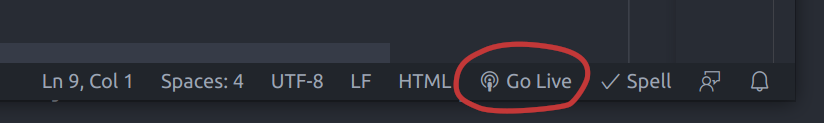

In this exercise we will build a minimal web page to explore the main aspects of *HTML*, *CSS* and *JavaScript*.

<!--more-->

You should think about where you are going to save all this work to keep it organised.
You probably need a folder for the entire module with subfolders for each of the lab exercises and your own experiments.

```markdown {linenos=false}
 CTEC2712
   ├─ exercises
   │    ├─ folder_1
   │    └─ folder_2
   └─ experiments
        ├─ experiment_1
        └─ experiment_2
```

> Don't blindly copy these folder names.
> You should think.. use sensible names that make sense to you!


## An experiment

Create a new folder for a small experiment.
Think about a naming convention that makes sense to you.
Maybe call it **vscode-experiment** or similar.

Open your new folder in VSCode and create a file **index.html**.

```markdown {linenos=false}
 CTEC2712
   └─ exercises
        └─ vscode-experiment
             └─ index.html
```

> It is crucial that you open the **folder** in VSCode, not the file.

Add the following, minimal content to the file.

```html
<!DOCTYPE html>
<html>
<head>
    <title>VSCode experiment</title>
</head>
<body>
    <p>This is an experiment.</p>
</body>
</html>
```

It should look something like this.



It's important that the top-level folder in the VSCode explorer window is your new folder.
This will become the root folder for the *live server* extension.
Remember, you can start the *live server* extension by clicking the *go live* button.

>
>
>You should always use this, we won't remind you again.

The site should open in your browser, looking something like this:



> Note that the **index.html** file is picked automatically as this is the default name for the index file.
Try renaming the file and you should get a very different response.

The content we added includes a `<title>` in the `<head>` of the document and a paragraph (`<p>`) in the `<body>` of the document.
You should see the title appears only in the browser tab above the page, not as part of the visible page itself.
The entire page content is our simple paragraph.

Obviously, this is a very simple document.
We have to start somewhere.

## More content

Try experimenting by making a second file with different content.
Add links to each file to allow the user to navigate between them.  

Something like this:

### index.html

```html {hl_lines="8"}
<!DOCTYPE html>
<html>
<head>
    <title>VSCode experiment</title>
</head>
<body>
    <p>This is an experiment.</p>
    <p>See the <a href="about.html">about</a> page for more information</p>
</body>
</html>
```

We have added a second paragraph (`<p>`) containing some text and a hyperlink (an anchor tag `<a>`) pointing to another file *about.html*.
The content of the hyperlink element is the clickable text.

> `<a>` tags are *inline* elements. 
This essentially means they can be inserted into text.
>

### about.html

Create the *about.html* file.

```markdown {linenos=false, hl_lines="4"}
 CTEC2712
   └─ exercises
        └─ vscode-experiment
             ├─ about.html
             └─ index.html
```


Add the following content.

```html
<!DOCTYPE html>
<html>
<head>
    <title>VSCode experiment</title>
</head>
<body>
    <p>This is the about page.</p>
    <p>Go back to the <a href="index.html">home</a> page.</p>
</body>
</html>
```

It is very similar to *index.html*, but the hyperlink points back to the original *index.html* file.

>The two files must be in the same folder.

The result is a two-page website.





> Try creating another few pages with different content.
Make sure all the pages can be accessed.
Notice how the pages can be linked in a web.
This is what we mean by a *hypertext* document.

## Adding styles

OK, the above site is clearly very basic.

Update *index.html* as follows.

```html {hl_lines="5-10"}
<!DOCTYPE html>
<html>
<head>
    <title>VSCode experiment</title>
    <style>
        body {
            background-color: red;
            color: white;
        }
    </style>
</head>
<body>
    <p>This is an experiment.</p>
    <p>See the <a href="about.html">about</a> page for more information</p>
</body>
</html>
```

We've added a `<style>` element within the `<head>` of the document.
This allows us to add *CSS rulesets* that modify the way the browser renders the content of the document.

We have added some very simple rules which will apply to the entire document `<body>`.

Do something similar to the *about.html* file.

```html {hl_lines="5-10"}
<!DOCTYPE html>
<html>
<head>
    <title>VSCode experiment</title>
    <style>
        body {
            background-color: yellow;
            font-size: 1.4em;
        }
    </style>
</head>
<body>
    <p>This is the about page.</p>
    <p>Go back to the <a href="index.html">home</a> page.</p>
</body>
</html>
```

You should notice the difference in the browser.
Each page in the site now has a distinct look.



> Try modifying any additional pages you created in similar ways.

### A CSS file

Typically, we want all the pages in our site to have common style rules.
To achieve this, we can move our style information to a CSS file and *link* to the file from all our pages.

Create a new file *style.css* and add the following content:

```css
body {
    background-color: orange;
    font-size: 1.4em;
    font-family: cursive;
}
```

Now we can remove the `<style>` elements (and all their content) from our html documents and replace it with the following line.

```html {hl_lines="5"}
<!DOCTYPE html>
<html>
<head>
    <title>VSCode experiment</title>
    <link rel="stylesheet" href="style.css">
</head>
<body>
    <p>This is an experiment.</p>
    <p>See the <a href="about.html">about</a> page for more information</p>
</body>
</html>
```

> This is a `<link>` element.
It represents a link to another file.
In this case, the *relationship* to this document is a *stylesheet*.
This tells the browser that the file will contain *CSS ruleset* information that should be applied to the document.

Now *all* our pages can have a consistent style, any changes we make to the *style.css* file will be applied to *all* our pages.




## Adding JavaScript

Using JavaScript, we can modify the *Document Object Model*.
For example, we can create new elements and insert them into the page.

Open the developer tools in *Chrome* and select the *JavaScript Console*.

> You can use *Ctrl + Shift + J* to open the JavaScript console.

Here are three lines of code.

```js
const element = document.createElement("p");
element.textContent = "hello";
document.body.append(element);
```

The above code does three things.

1. Creates a paragraph element.
1. Adds some text into the paragraph.
1. Appends the element into the *DOM*. 

Try typing these into the console.
The first two don't make any difference to the page because the `<p>` element is not yet in the *DOM*.
You should see that the final line inserts our newly created element into the page.

> Notice that you can do this on any web page.
It doesn't matter what web page you are viewing.
However, it's easier to see what's happening if you use your own page.

### Create a paragraph

The first line declares a (constant) variable `element` and assigns it to a newly created paragraph element.

```js {hl_lines="1"}
const element = document.createElement("p");
element.textContent = "hello";
document.body.append(element);
```

> Variables declared with the `const` keyword cannot be reassigned with `=` later in the code.
> It's good practice to always use `const` unless you need to reassign, in which case, use the `let` keyword.

### Add some content

The second line modifies the paragraph element by updating its `textContent` property.

```js {hl_lines="2"}
const element = document.createElement("p");
element.textContent = "hello";
document.body.append(element);
```

> Element objects have many properties and many ways to modify their content. 
> The `textContent` property is particularly efficient when working with simple text.

### Insert it into the *DOM*

The final line appends the paragraph to the end of the document `<body>` element.

```js {hl_lines="3"}
const element = document.createElement("p");
element.textContent = "hello";
document.body.append(element);
```

> The `document` is a global object made available by the browser.
> It provides an extensive API which can be used to interact with the *DOM*.
> In this case, we are accessing the [document.body](https://developer.mozilla.org/en-US/docs/Web/API/Document/body) property.

## Defining a script

Writing code in the JavaScript console is very useful for experiments and testing. 
However, if we want to build JavaScript into our HTML document, we need to include a `<script>` element.

In our *index.html* file, we can add a `<script>` element and put our code inside it.

```html
<!DOCTYPE html>
<html>
<head>
    <title>VSCode experiment</title>
    <link rel="stylesheet" href="style.css">
</head>
<body>
    <p>This is an experiment.</p>
    <p>See the <a href="about.html">about</a> page for more information</p>
    <script>
        const element = document.createElement("p");
        element.textContent = "hello";
        document.body.append(element);
    </script>
</body>
</html>
```


The browser continuously builds the *DOM* as it parses the file line-by-line.
Each element is added into the *DOM* as soon as it is encountered.
The browser will see the `<script>` element and execute our code.
By default, scripts are executed immediately.

> Simple `<script>` elements like this are often added as *the last element* within the body.

Loading the page shows that the page now has an extra paragraph inserted at the end.



## Separate JavaScript files

Rather than including code directly in the HTML document, our `<script>` element can be given an `src` attribute that points to a file containing the code.

Create a new file *script.js* with our code.

```js
const element = document.createElement("p");
element.textContent = "hello";
document.body.append(element);
```

Now we can remove the code from the `<script>` element and simply point to it with the `src="script.js"` attribute.
This keeps the HTML document simple and separates the content from the behaviour, just like the CSS file separates the presentation.

```html
<!DOCTYPE html>
<html>
<head>
    <title>VSCode experiment</title>
    <link rel="stylesheet" href="style.css">
</head>
<body>
    <p>This is an experiment.</p>
    <p>See the <a href="about.html">about</a> page for more information</p>
    <script src="script.js"></script>
</body>
</html>
```

> The page should still work exactly as before.

### Script location

Notice that the two *hard-coded* paragraphs are loaded into the *DOM* **before** the script is executed.

Move the `<script>` element up so it is in between the two paragraphs.

```html {hl_lines="9"}
<!DOCTYPE html>
<html>
<head>
    <title>VSCode experiment</title>
    <link rel="stylesheet" href="style.css">
</head>
<body>
    <p>This is an experiment.</p>
    <script src="script.js"></script>
    <p>See the <a href="about.html">about</a> page for more information</p>
</body>
</html>
```

The result is that our dynamically generated paragraph is moved up.
This is because the `<body>` only includes one paragraph when the script is executed.

> Remember, line 3 of the script appends our paragraph to the end of the `<body>` element.

Move the `<script>` element above the two paragraphs.

```html {hl_lines="8"}
<!DOCTYPE html>
<html>
<head>
    <title>VSCode experiment</title>
    <link rel="stylesheet" href="style.css">
</head>
<body>
    <script src="script.js"></script>
    <p>This is an experiment.</p>
    <p>See the <a href="about.html">about</a> page for more information</p>
</body>
</html>
```

Now the `<body>` will be empty when the script is executed.

In each case, the new paragraph is added earlier in the process and the browser continues parsing the file after the script has completed.

### Scripts in the `<head>`

Moving our script into the `<head>` is also allowed.

```html {hl_lines="6"}
<!DOCTYPE html>
<html>
    <head>
    <title>VSCode experiment</title>
    <link rel="stylesheet" href="style.css">
    <script src="script.js"></script>
</head>
<body>
    <p>This is an experiment.</p>
    <p>See the <a href="about.html">about</a> page for more information</p>
</body>
</html>
```

However, our code causes an error if we move it into the `<head>`.

> The JavaScript console reports this error:
>```markdown {linenos=false}
>Uncaught TypeError: Cannot read properties of null (reading 'append')
>    at script.js:3:15
>```
> Error messages require careful attention.
> This one tells us exactly what went wrong.
> It says we tried to read the `append` property of `null`.
>
> It reports the error occurred at the 15th character on line 3 of *script.js*
>
> ```js {hl_lines="3"}
> const element = document.createElement("p");
> element.textContent = "hello";
> document.body.append(element);
> ```
> We know that we were trying to call the `append` method of the `<body>` element here.
>
> Our first task when debugging is to understand *what happened* and *why*.
>
> Firstly we can be certain that the `body` property of the `document` object has a value of `null`.
> We should realise that `null` has no `append` method, this is why the error occurred.
>
> This is important to understand.
> Error messages tell us exactly where to look and exactly what caused the error.

The reason is that *by default* a `<script>` in the `<head>` of a document will execute *before* the `<body>` element has been added into the page.
The solution is to mark the script with a `defer` attribute like this:

```html {hl_lines="6"}
<!DOCTYPE html>
<html>
    <head>
    <title>VSCode experiment</title>
    <link rel="stylesheet" href="style.css">
    <script src="script.js" defer></script>
</head>
<body>
    <p>This is an experiment.</p>
    <p>See the <a href="about.html">about</a> page for more information</p>
</body>
</html>
```

> The `defer` attribute tells the browser to defer execution of the script until the document has been fully parsed.

Or we can declare the script to be a JavaScript *module* by setting the `type="module"` attribute.

```html {hl_lines="6"}
<!DOCTYPE html>
<html>
<head>
    <title>VSCode experiment</title>
    <link rel="stylesheet" href="style.css">
    <script src="script.js" type="module"></script>
</head>
<body>
    <p>This is an experiment.</p>
    <p>See the <a href="about.html">about</a> page for more information</p>
</body>
</html>
```

> JavaScript modules provide a number of advantages, in particular they allow for splitting code over multiple files and using `import` and `export` statements within our code.
> This is only important when a javascript project becomes larger and more complex.

## Creating a function

Now wrap the three lines of javascript in a function definition.

```js {hl_lines="1 5"}
function insertParagraph() {
    const element = document.createElement("p");
    element.textContent = "hello";
    document.body.append(element);
}
```

We have named our function `insertParagraph`.
Notice that the code only defines the function.
We are not executing the function, so the paragraph is no longer added to the page.

However, it is easy to call our function.
We can now add multiple calls to the function to run the same code multiple times.

```js {hl_lines="6-9"}
function insertParagraph() {
    const element = document.createElement("p");
    element.textContent = "hello";
    document.body.append(element);
}

insertParagraph();
insertParagraph();
insertParagraph();
```

You should now see three new paragraphs have been added to the page.
Our code defines a function and then calls it three times.

## Interaction

You may have noticed that our code is a bit pointless.
We could easily include three `<p>hello</p>` elements directly in the HTML to get the same result.

To make it more interesting, we will add a button to the page which appends a new item to a list every time it is clicked.

JavaScript is great for making a site interactive.
There are a few important concepts we need to know.

1. There are things called *events*, which can be triggered by the user.
1. *Functions* can be used as *event handlers* in response to *events*.

> Events can be triggered in other ways too, but we will focus on the *click* event which occurs when the user clicks a mouse button with the mouse pointer over an element.

Let's add a button into *index.html*.

```html {hl_lines="11"}
<!DOCTYPE html>
<html>
<head>
    <title>VSCode experiment</title>
    <link rel="stylesheet" href="style.css">
    <script src="script.js" type="module"></script>
</head>
<body>
    <p>This is an experiment.</p>
    <p>See the <a href="about.html">about</a> page for more information</p>
    <button id="my-btn">click me</button>
</body>
</html>
```

But clicking the button does nothing.
We need to tell the browser to listen for the buttons `click` event and call our function whenever it is triggered.

Notice, we added an `id="my-btn"` attribute to the button.
This allows us to easily pinpoint the specific element using JavaScript.

```js {hl_lines="1-2"}
const btn = document.getElementById('my-btn');

function insertParagraph() {
    const element = document.createElement("p");
    element.textContent = "hello";
    document.body.append(element);
}

insertParagraph();
insertParagraph();
insertParagraph();
```

Now, we can add an `EventListener` to the button, passing two arguments, the event type we want to listen for and the function to call when the event triggers.

```js {hl_lines="9"}
const btn = document.getElementById('my-btn');

function insertParagraph() {
    const element = document.createElement("p");
    element.textContent = "hello";
    document.body.append(element);
}

btn.addEventListener('click', insertParagraph);
```

Now clicking the button should add a paragraph into the page.



## A final tweak

Ok, we are nearly finished now.
We just want to modify how this works by adding a few tweaks to the HTML, CSS and JavaScript.

### Add a container

First, we will add a new `<div id="output">` element into *index.html*.
This will contain our paragraphs and will ultimately allow us to modify the layout of the paragraphs using CSS.

```html {hl_lines="12"}
<!DOCTYPE html>
<html>
<head>
    <title>VSCode experiment</title>
    <link rel="stylesheet" href="style.css">
    <script src="script.js" type="module"></script>
</head>
<body>
    <p>This is an experiment.</p>
    <p>See the <a href="about.html">about</a> page for more information</p>
    <button id="my-btn">click me</button>
    <div id="output"></div>
</body>
</html>
```

### Use the container

Now we can tweak *script.js* to append the new elements to the new element rather than directly into the `<body>`. 

```js {hl_lines="2 7"}
const btn = document.getElementById('my-btn');
const output = document.getElementById('output');

function insertParagraph() {
    const element = document.createElement("p");
    element.textContent = "hello";
    output.append(element);
}

btn.addEventListener('click', insertParagraph);
```

> Use the *elements* panel in the developer tools to watch what happens to the DOM when you click the button a few times.
> You should see that the changes we are making to the DOM are very simple.
> We are adding a new `<p>hello</p>` into the `<div id="output">` element every time we click.

### Style the container

Finally, we can start playing with the way we present the document by modifying *style.css*.

Add a ruleset for the `#output` selector, setting the background colour for the `<div>` to `red`.


```css {hl_lines="6-9"}
body {
    background-color: orange;
    font-size: 1.4em;
    font-family: cursive;
}

#output {
    background-color: red;
}
```

> CSS selectors allow us to pinpoint elements we want to style.
> We can select specific ids using the `#id` selector.

Now let's add another ruleset for the `#output p` selector, which will apply to all the paragraph elements *inside* our `<div>`.

```css {hl_lines="10-13"}
body {
    background-color: orange;
    font-size: 1.4em;
    font-family: cursive;
}

#output {
    background-color: red;
}

#output p {
    background-color: yellow;
}
```

> [Combinators](https://developer.mozilla.org/en-US/docs/Learn/CSS/Building_blocks/Selectors/Combinators) allow us to combine selectors to pinpoint more specific elements.
> The space in `#output p` selector is known as the *decendant combinator*.
> `#output p` selects all `p` elements which are decendants of (i.e. are inside) the `#output` element.

Click the button a few times to see the impact. 
Make sure you understand what just happened.


> The *normal* paragraphs, outside of the `#output` element, are unaffected.

Notice that the yellow `<p>` elements are separated by a default top and bottom `margin`.
This allows us to see the red background of the containing `<div>` between them.

Also, the `<p>` elements themselves provide just enough room for the text content and no more.
We can add a bit of room by setting the padding.

```css {hl_lines="13"}
body {
    background-color: orange;
    font-size: 1.4em;
    font-family: cursive;
}

#output {
    background-color: red;
}

#output p {
    background-color: yellow;
    padding: 5px 10px;
}
```


### Modify the formatting context

Now we will change the [formatting context](https://developer.mozilla.org/en-US/docs/Web/CSS/CSS_flow_layout/Introduction_to_formatting_contexts) of the `<div>` by setting it's `display` property to `flex`.

The `display` property can completely change our `<div>` layout.
So the elements follow different rules from the default `block` formatting context.

By setting it to `flex`, we implicitly make all its direct children (i.e. all the `<p>` elements) into `flex-items`, changing their behaviour drastically.

Essentially, this means they will position themselves horizontally.

```css {hl_lines="9-13 19"}
body {
    background-color: orange;
    font-size: 1.4em;
    font-family: cursive;
}

#output {
    background-color: red;
    display: flex;
    flex-wrap: wrap;
    gap: 5px;
    justify-content: center;
    padding: 5px 10px;
}

#output p {
    background-color: yellow;
    padding: 5px 10px;
    margin: 0;
}
```

The result is clearly a major change.


> We also set the `flex-wrap` property.
This prevents the `<p>` elements from overflowing the page and allows them to wrap a bit like `inline` elements.

Try adding lots of elements.



Remember, all we did was change the CSS. 
The elements within the *DOM* are exactly the same.

## Conclusions

In this exercise we have seen that we can use *VSCode* and the *Chrome* browser together as a development environment for creating *static* websites.

1. We have created very simple HTML documents with basic content using *VSCode*.
1. We have served these documents using the *live server* extension and accessed them via the *Chrome* browser.
1. We added *hyperlinks* to allow us to navigate between pages.
1. We added *CSS rulesets* to provide different styles on each page.
1. We added JavaScript code to modify the *DOM* in response to user interaction.
1. We saw how changes to the *CSS* can make drastic changes to how the content are presented in the browser.

We can now use the developer tools in *Chrome* to view the site from a developers perspective.